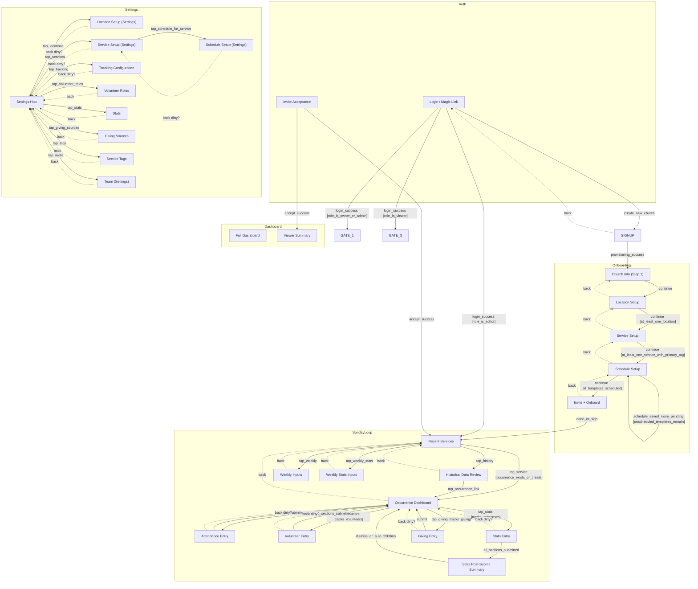
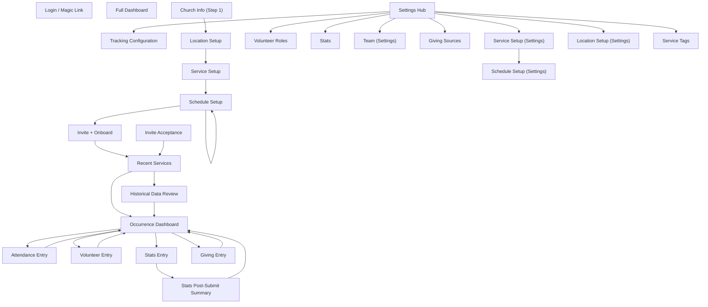
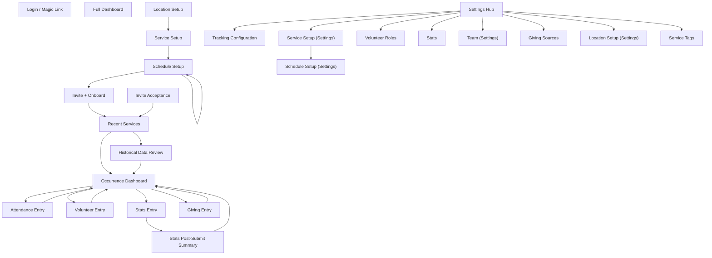
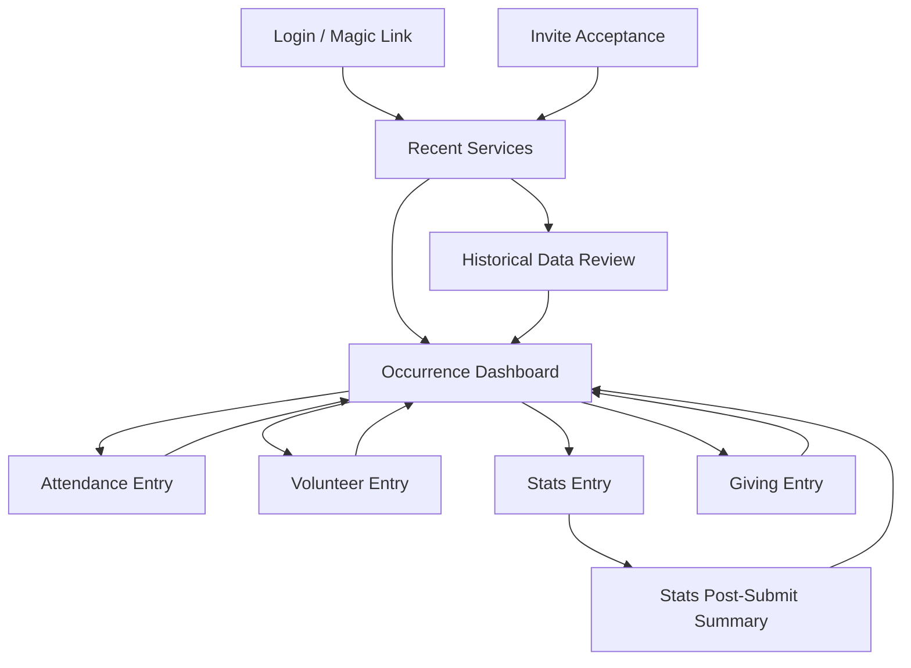
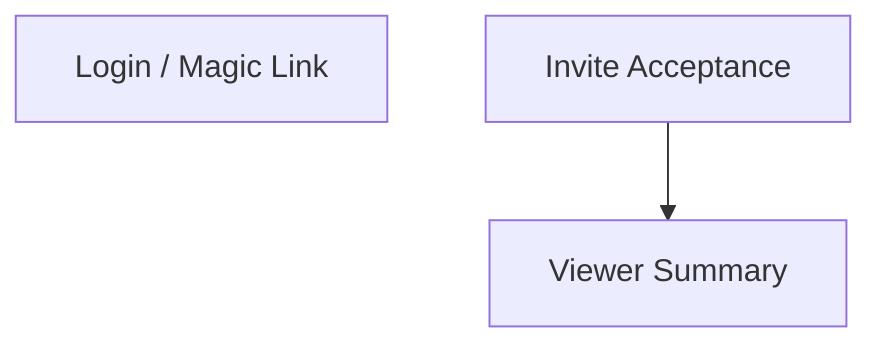

# FLOW_REPORT — Church Analytics
Generated: 2026-04-22 | Screens: 28 | Gates: 6

---

## Application Flow Diagram

---

## Route Table

| Screen ID | Name | Route | Layout | Tab | Root | Roles | Gates |
|-----------|------|-------|--------|-----|------|-------|-------|
| AUTH | Login / Magic Link | `/auth/login` | AuthLayout | — |  | O,A,E,V | — |
| INVITE_ACCEPT | Invite Acceptance | `/auth/invite/[token]` | AuthLayout | — |  | O,A,E,V | — |
| ONBOARDING_CHURCH | Church Info (Step 1) | `/onboarding/church` | OnboardingLayout | — |  | O | — |
| T_LOC | Location Setup | `/onboarding/locations` | OnboardingLayout | — |  | O,A | — |
| T6 | Service Setup | `/onboarding/services` | OnboardingLayout | — |  | O,A | — |
| T_SCHED | Schedule Setup | `/onboarding/schedule` | OnboardingLayout | — |  | O,A | — |
| T9 | Invite + Onboard | `/onboarding/invite` | OnboardingLayout | — |  | O,A | — |
| T1 | Recent Services | `/services` | AppLayout | services | ✓ | O,A,E | gate_1_setup |
| T1B | Occurrence Dashboard | `/services/[occurrenceId]` | AppLayout | services |  | O,A,E | — |
| T_HISTORY | Historical Data Review | `/services/history` | AppLayout | services |  | O,A,E | gate_1_setup |
| T_WEEKLY | Weekly Inputs | `/services/weekly` | AppLayout | services |  | O,A,E | gate_1_setup |
| T_WEEKLY_STATS | Weekly Stats Inputs | `/services/weekly-stats` | AppLayout | services |  | O,A,E | gate_1_setup |
| T2 | Attendance Entry | `/services/[occurrenceId]/attendance` | AppLayout | services |  | O,A,E | — |
| T3 | Volunteer Entry | `/services/[occurrenceId]/volunteers` | AppLayout | services |  | O,A,E | gate_tracks_volunteers |
| T4 | Stats Entry | `/services/[occurrenceId]/stats` | AppLayout | services |  | O,A,E | gate_tracks_responses |
| T4_SUMMARY | Stats Post-Submit Summary | `/services/[occurrenceId]/stats/summary` | AppLayout | services |  | O,A,E | — |
| T5 | Giving Entry | `/services/[occurrenceId]/giving` | AppLayout | services |  | O,A,E | gate_tracks_giving |
| D1 | Full Dashboard | `/dashboard` | AppLayout | dashboard | ✓ | O,A | gate_1_setup |
| D2 | Viewer Summary | `/dashboard/viewer` | AppLayout | dashboard | ✓ | V | gate_3_viewer |
| T_SETTINGS | Settings Hub | `/settings` | AppLayout | settings | ✓ | O,A | gate_role_settings |
| T_LOC_SETTINGS | Location Setup (Settings) | `/settings/locations` | AppLayout | settings |  | O,A | — |
| T6_SETTINGS | Service Setup (Settings) | `/settings/services` | AppLayout | settings |  | O,A | — |
| T_SCHED_SETTINGS | Schedule Setup (Settings) | `/settings/services/[templateId]/schedule` | AppLayout | settings |  | O,A | — |
| T6B | Tracking Configuration | `/settings/tracking` | AppLayout | settings |  | O,A | — |
| T7 | Volunteer Roles | `/settings/volunteer-roles` | AppLayout | settings |  | O,A | — |
| T8 | Stats | `/settings/stats` | AppLayout | settings |  | O,A | — |
| T_GIVING_SOURCES | Giving Sources | `/settings/giving-sources` | AppLayout | settings |  | O,A | — |
| T_TAGS | Service Tags | `/settings/tags` | AppLayout | settings |  | O,A | — |
| T9_SETTINGS | Team (Settings) | `/settings/team` | AppLayout | settings |  | O,A | — |
| SIGNUP | New Church Signup | `/signup` | AuthLayout | — |  |  | — |

---

## Per-Role Journeys

### Owner

### Admin

### Editor

### Viewer

---

## Gate Map

| Gate ID | Name | Condition | Fail Redirect | Roles |
|---------|------|-----------|---------------|-------|
| gate_1_setup | Gate 1 — Setup Completion | Church has at least one location AND at least one service with a primary tag AND at least one active schedule version | ONBOARDING_CHURCH | O,A,E |
| gate_3_viewer | Gate 3 — Viewer Containment | Role is viewer | D2 | V |
| gate_role_settings | Settings Role Gate | Role is owner or admin | T1 | E,V |
| gate_tracks_volunteers | Volunteer Tracking Gate | church.tracks_volunteers = true | T1B | O,A,E |
| gate_tracks_responses | Stats Tracking Gate | church.tracks_responses = true | T1B | O,A,E |
| gate_tracks_giving | Giving Tracking Gate | church.tracks_giving = true | T1B | O,A,E |

---

## Shared State Map

| State | Scope | Used By |
|-------|-------|---------|
| SUNDAY_SESSION | session | T1B, T2, T3, T4, T4_SUMMARY, T5 |

SUNDAY_SESSION: Occurrence context (occurrenceId, serviceDisplayName, serviceDate, locationName).
Written on T1 tap. Read by T1b, T2, T3, T4, T4_SUMMARY, T5.
Keyed by date in sessionStorage: sunday_session_[YYYY-MM-DD].
Restoration pointer: sunday_last_active.
If empty on T2+ load: redirect to T1.

---

## AppFlow Findings

### Orphaned Routes (no inbound — unreachable)
- D1

### Dead Ends (no outbound, not declared terminal)
— None found.

### Missing Back Navigation (non-root screens with no back)
- ONBOARDING_CHURCH

### Screens Pending IRIS Map
- D1 (Full Dashboard) — routes defined, element map pending
- D2 (Viewer Summary) — routes defined, element map pending

### Settings Dual-Route Note
T_LOC, T6, T_SCHED, T9 each have two routes:
- Onboarding route (OnboardingLayout, no tab bar)
- Settings route (AppLayout, tab bar)
These are separate screen entries in the manifest (T_LOC vs T_LOC_SETTINGS etc.)
NOVA must implement both routes in Next.js with shared underlying components.
