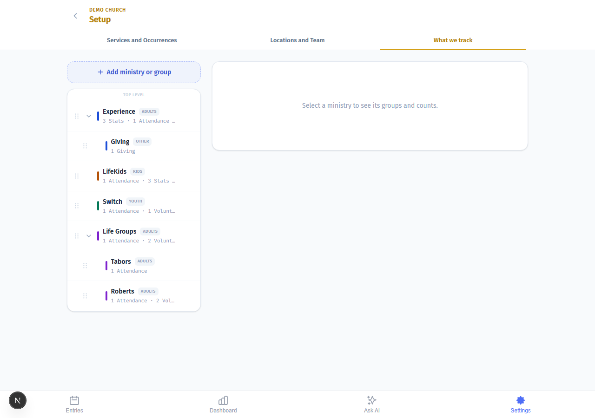
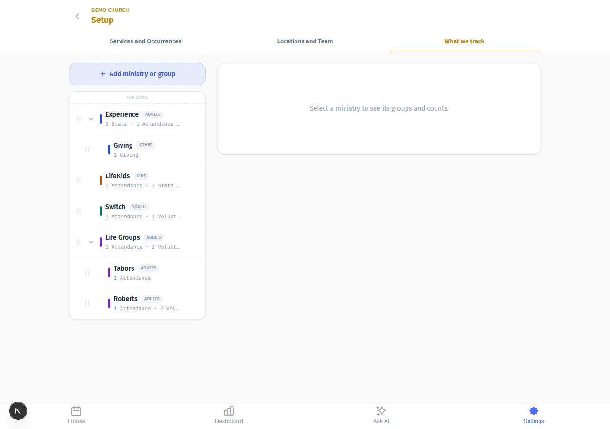
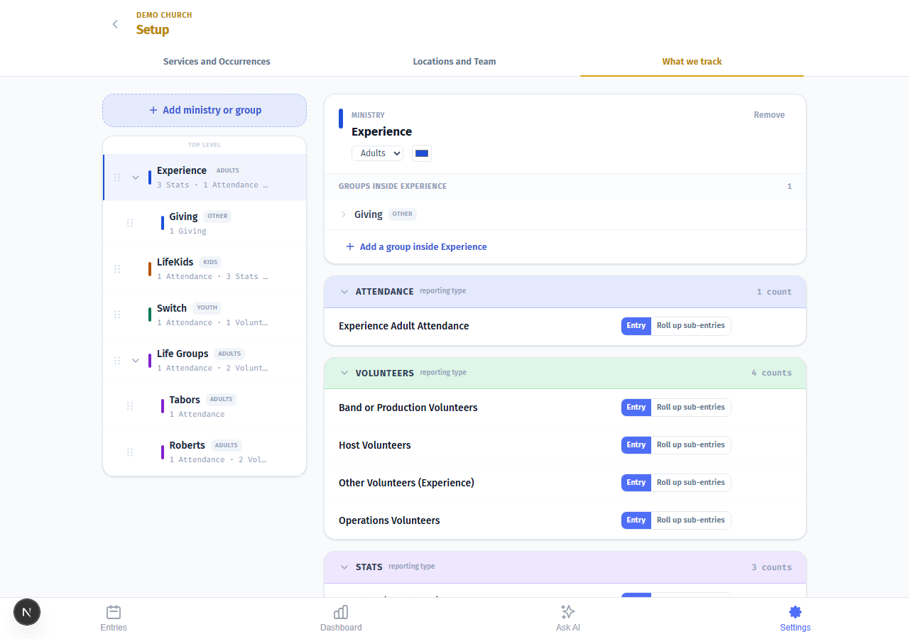
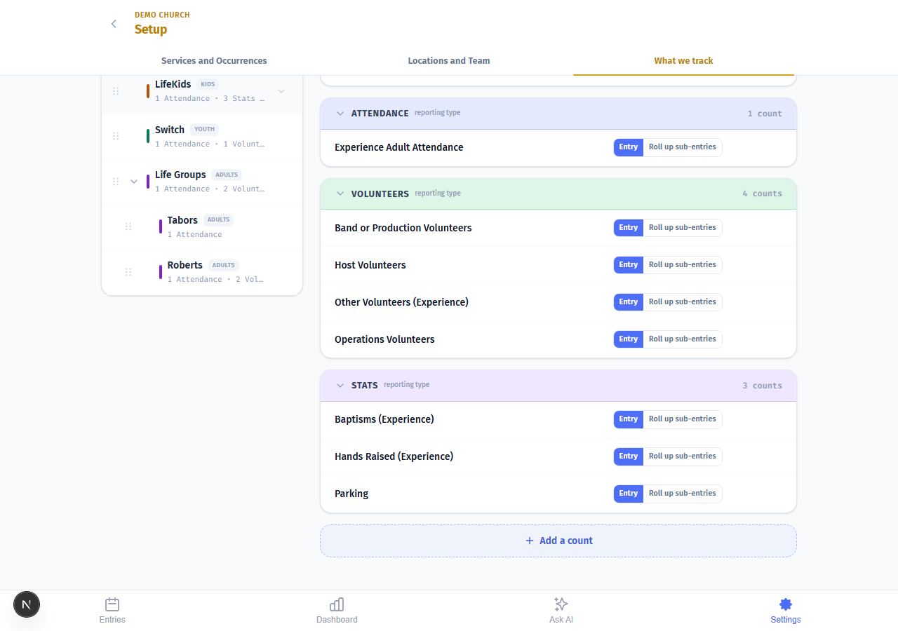
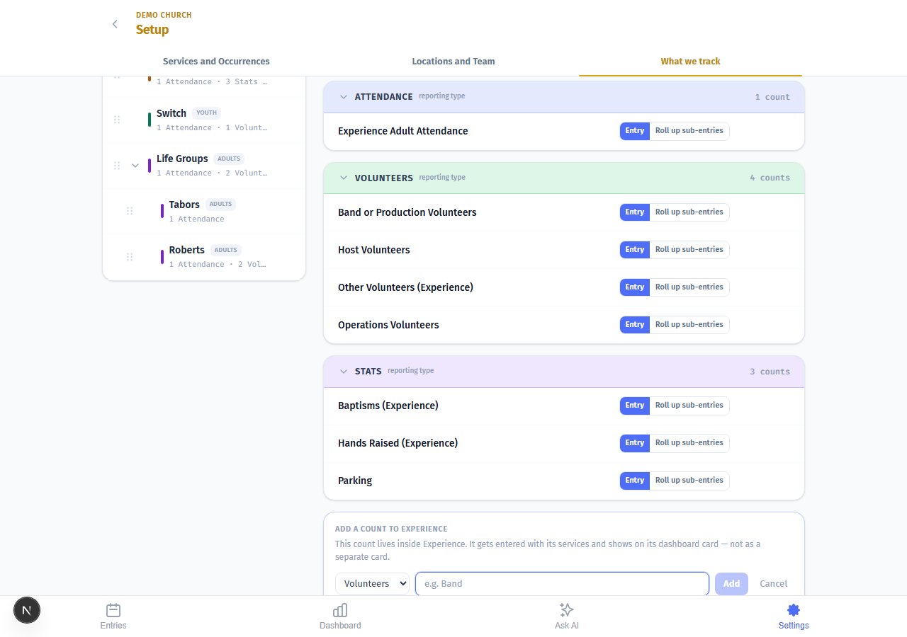
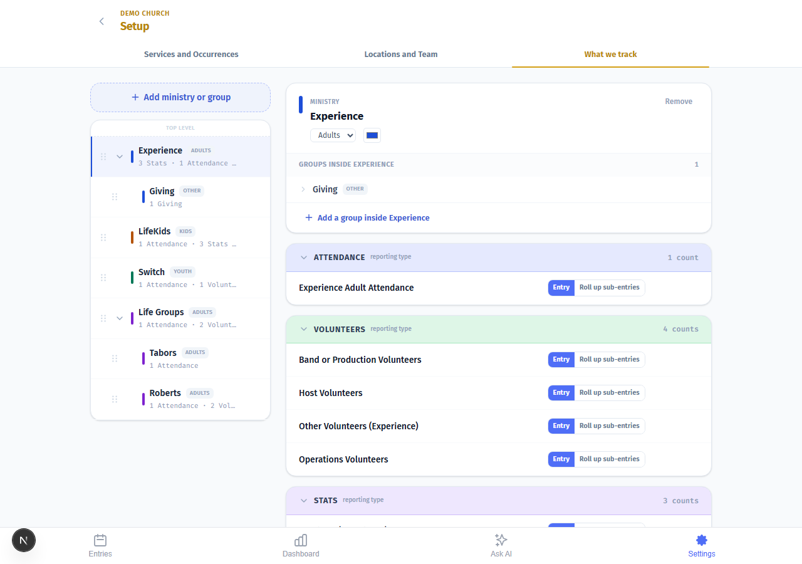
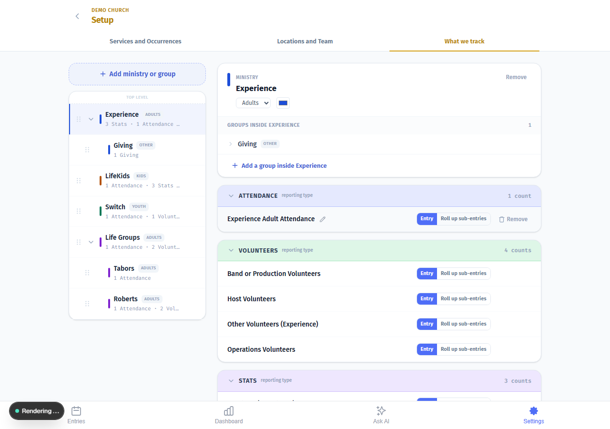
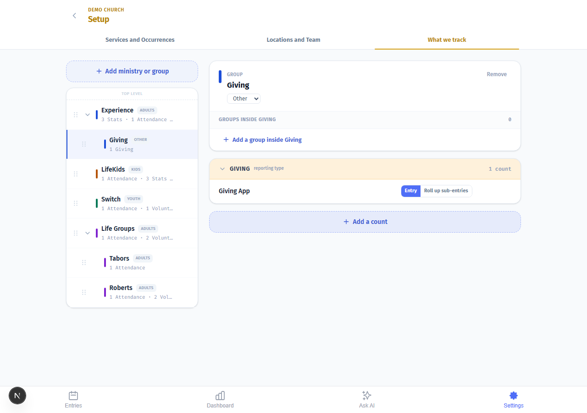

# What We Track — Visual Setup Guide

> Step-by-step guide with screenshots. Everything you need to set up your ministry tree, add counts, and understand how the dashboard gets its numbers.

---

## The big picture — your ministry tree

The left side of this screen shows every ministry your church tracks. Each row is either a top-level ministry (gets its own dashboard card) or a group nested inside one (rolls up to the parent card). The right side shows the detail — counts, groups, and settings — once you select a ministry.

Nothing is selected yet here. This is what you'll see when you first open the screen.

---

## Ministries and Groups — what's the difference?

**Top-level means its own dashboard card.** Anything sitting at the top of the tree gets its own color, its own chart, its own trend line. Think of a whole service — Experience, LifeKids, Switch — or something church-wide like Giving.

**Groups are breakdowns inside a ministry.** They appear indented in the tree. You count them separately in Entries, but the dashboard adds them all up under the parent. Tabors and Roberts, for example, are both groups inside Life Groups.

The rule is simple: if it deserves its own dashboard card, make it top-level. If it's a breakdown of something that already exists, nest it.

---

## Adding a new ministry or group

The **Add ministry or group** button lives at the top of the left panel. Click it to create something brand new at the top level — its own dashboard card, its own color, its own trend line.

If you want to add a breakdown inside an existing ministry instead, click that ministry first and use **Add a group inside** at the bottom of its detail panel.

---

## Selecting a ministry — the detail panel

Click any ministry in the tree and the right panel opens its detail. Here you can see:

- The **Ministry** label (top-level) or **Group** label (nested)
- The ministry name
- The **Role** badge — Adults, Kids, Youth, or Other. This describes the audience but doesn't change how the dashboard treats it.
- The **color** swatch — the color that follows this ministry everywhere
- All the **groups** inside it (if any)
- All the **counts** set up inside it

This is Experience selected, showing its groups and counts.

---

## Adding a group inside a ministry

Scroll to the bottom of the detail panel and you'll find **Add a group inside [Ministry Name]**. Use this when you want to track something separately in Entries — like two campus locations, or two service times — but you don't need a separate dashboard card.

The group's numbers will roll up to the parent ministry on the dashboard.

---

## Adding a count

Every number you track lives in a count. Below the groups section you'll find **Add a count** — this is where you add something new to track inside the selected ministry.

---

## The Add a count form

Click **Add a count** and the form expands. Pick the **kind** first — Attendance, Volunteers, Stats, or Giving. You can't change the kind after you save it, so pick carefully.

- **Attendance** — people in the room
- **Volunteers** — people serving; add each role separately
- **Stats** — anything that's a number but not a headcount (baptisms, salvations, first-time guests)
- **Giving** — dollar amounts; add one count per collection method

Then give the count a name and save.

---

## Entry vs. Roll-up

Every count you create is one or the other.

**Entry** means you type it. Every week you open Entries and put a number in. Use this for every real number you count — attendance per service, each volunteer role, each giving source.

**Roll-up** means the math is done for you. You set it to combine other entries — adding them, averaging them, or taking the highest — and you never type it directly. Use this for calculated totals: a "Total Weekend Attendance" that adds two service times automatically.

The toggle appears on each count row. The default is Entry.

---

## Roll-up with an operation

When you switch a count to **Roll up sub-entries**, a second line appears where you choose how to combine the numbers — Sum, Average, or Max.

Don't do both. If you're entering a number manually, don't also set up a Roll-up for it. If the Roll-up is calculating it, don't type it manually. Pick one.

---

## Giving — its own top-level ministry

Giving almost always needs to be top-level. Here's why: if Giving lives inside Experience, the system expects you to enter giving amounts once for the 9am service and again for the 11am service. That's not how giving works — you have one total for the weekend.

The test: *Would I enter this once per service, or once for the whole week?* Giving is once for the whole week, so it gets its own home at the top level.

Click Giving in the tree and you'll see it's set up as a top-level ministry with its own counts.

---

## The Weekly · church-wide badge

Some counts show a **Weekly · church-wide** badge. This means the count is entered once per week for the whole church — not once per service, and not per campus. It appears at every campus automatically.

Giving is the most common example. If you see this badge, you enter one number per week total, regardless of how many services ran.

---

## Quick answers

**Should I make this a ministry or a group?**
If it needs its own dashboard card — top-level. If it's a breakdown of something that already exists — nest it.

**I have two giving sources. Do I need two top-level nodes?**
No. Add two counts under one Giving node. The dashboard totals them.

**Do I need a "Total Volunteers" count?**
No. Add the individual roles and the system adds them up. A manual total double-counts everyone.

**Do I need a "Total Giving" count?**
Same reason — no.

**I run two services and want one combined attendance.**
Add an Entry count per service. Add a Roll-up count on the parent ministry. The Roll-up does the math.

**The service didn't meet this week. What do I enter?**
Nothing. Leave it blank. Blank means the service didn't run. Zero means it ran and nobody came — zeros pull your averages down as though you held services with empty rooms.

**I moved ministries around and the colors changed.**
Order drives color. First ministry gets color 1, second gets color 2, and so on. Set your order before you start counting, or use the color picker to set a custom color that sticks regardless of position.
